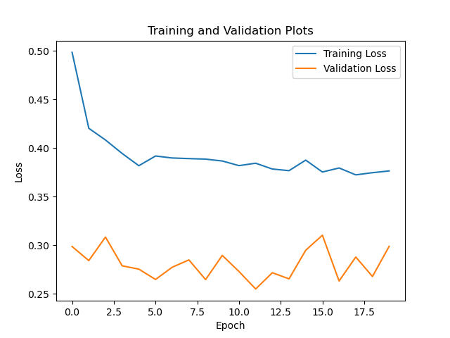
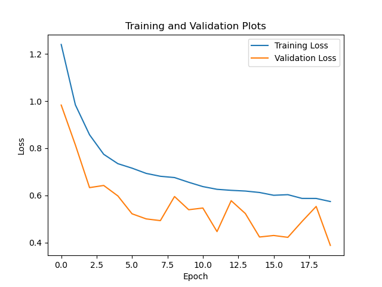

# Transfer Learning

#### Transfer Learning:
Transfer learning is a technique used in machine learning and artificial intelligence to reuse a pre-trained model to solve a different but related problem. There are several types of transfer learning:

#### Types of transfer learning:
1. Finetuning
2. Feature Extraction

#### Finetuning:
Finetuning is a type of transfer learning in which a pre-trained model is further trained on a new dataset for a specific task. The pre-trained model is typically a deep neural network that has been trained on a large dataset, such as ImageNet or COCO, for a related task, such as image classification or object detection. Finetuning involves taking the pre-trained model and training it on a smaller dataset that is specific to a new task. The training process in finetuning involves training all the model parameters.

#### Feature Extraction:
Feature extraction is a widely used transfer learning technique where a pre-trained model is employed to extract features from data. The pre-trained model is typically a deep neural network that has been trained on a large dataset for a related task. In this approach, the pre-trained model is utilized, and only the last layer of the network is modified, and its weights are updated, while keeping the other layers frozen. This is particularly useful when the new task has insufficient training data. 

#### Data Used:

The data that will be used for performing fine tunning and feature extraction will be image data of natural scenes around the world. The data contains around 25k images of size 150 x 150 distributed amoung 6 categories.

The six categories are buildings, forest, glacier, mountain, sea and street. The data is divided into training and test split. The training set consists of 14k images and the test set consists of 3k images.

#### Models used:

The models that will be used are: 
1. Resnet
2. Alexnet
3. Vgg
4. Squeezenet
5. Densenet

#### Steps involved in Transfer Learning:

1. Load the pretrained weights into the model.
2. Modify the last layer to have the same number of output as the number of classes in the new dataset.
3. Define the parameters to be updated during the training process by the optimizer.
4. Start the training process.

#### Benefits of transfer learning:

1. Reduced training time: Transfer learning can significantly reduce the amount of time and resources required to train a model from scratch. By starting with a pre-trained model, we can fine-tune it to the new task in a much shorter amount of time.

2. Improved performance: Transfer learning can lead to better performance on the new task, especially when the amount of available training data is limited. By using a pre-trained model as a starting point, we can leverage the knowledge and features learned by the model on a related task to improve its performance on the new task.

3. Better generalization: Transfer learning can also improve the ability of a model to generalize to new data. By starting with a pre-trained model that has already learned general features, we can fine-tune the model to the new task with a smaller risk of overfitting to the training data.

4. Easy adaptation to new tasks: Transfer learning allows models to be adapted easily to new tasks, making it a useful technique in applications such as natural language processing, computer vision, and speech recognition.

#### Download the data used:

1. The data used can be downloaded from the following link ([Natural Scene Data](https://www.kaggle.com/datasets/puneet6060/intel-image-classification)). 

2. Place the downloaded data in the following folder structure:

    <code>
    natural_scene_data/
    ├── seg_test/
    │   ├── class1/
    │   │   ├── image1.jpg
    │   │   ├── image2.jpg
    │   │   └── ...
    │   └── class2/
    │       ├── image1.jpg
    │       ├── image2.jpg
    │       └── ...
    └── seg_train/
        ├── image1.jpg
        ├── image2.jpg
        ├── image3.jpg
        └── ...
    </code>

3. You can also run the script on custom dataset. Download the necessary data and make sure to arrange the dataset as per step 2.

#### Run the script

```python
python finetune_fextract.py --model_name squeezenet
```
Supported models: [resnet, alexnet, vgg, squeezenet, densenet]

#### Output

1. Training and validation plot for feature extraction:


2. Training and validation plot for fine extraction:



